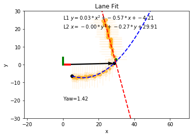

# 树莓派双足机器人

[TOC]

## 目录

### 机器人使用手册

* [DBSP双足机器人使用手册](doc/DBSP双足机器人使用手册/DBSP双足机器人使用手册.md)

* [巡线算法详解与调参指南](doc/巡线算法详解与调参指南/巡线算法详解与调参指南.md)

  
  
  

### 附录A 树莓派开发环境配置

树莓派开发环境配置有两种方式, 一种是导入现有的配置好的镜像文件, 另外一种是手动从零配置开发环境(麻烦, 难度大且易出错), **推荐使用第一种方式** 

1. **方法1-导入现有的配置好的镜像文件**

   直接使用配置好环境的树莓派镜像，这样各种系统配置文件也都是配置好了的, 不用自己安装各种依赖包，以及编译OpenCV了. 

   [树莓派镜像制作与备份](doc/附录A.开发环境配置/0.树莓派镜像制作与备份/树莓派镜像制作与备份.md)

   [配置好开发环境的树莓派镜像下载地址](https://pan.baidu.com/s/1OAXjFKYZfzy0U2IZ3nGA1w) <- **下载这个树莓派镜像**

   必须需要使用16G的SD卡

   默认的用户名 `pi`

   默认的用户密码 `raspberry`

2. **不推荐** *方法2-从零配置树莓派开发环境*

   * [树莓派安装](doc/附录A.开发环境配置/1.树莓派安装指南/树莓派安装.md)
   * [树莓派命令行速查手册](doc/附录A.开发环境配置/2.树莓派命令行速查手册/树莓派命令行速查手册.md)
   * [修改树莓派的源](doc/附录A.开发环境配置/3.修改树莓派的源/修改树莓派的源.md)
   * [修改pip的源](doc/附录A.开发环境配置/4.修改pip的源/修改pip的源.md)
   * [安装软件依赖](doc/附录A.开发环境配置/5.安装软件依赖/安装软件依赖.md)
   * [OpenCV的编译与安装](doc/附录A.开发环境配置/6.OpenCV的编译与安装/OpenCV的编译与安装.md)
   * [树莓派硬件串口配置与实验](doc/附录A.开发环境配置/7.树莓派硬件串口配置与实验/树莓派硬件串口配置与实验.md)
   * [MPU6050与树莓派通信](doc/附录A.开发环境配置/8.MPU6050与树莓派通信/MPU6050与树莓派通信.md)

### 附录B 其他教程

- [DBSP机器人动作编辑器使用指南](doc/附录B.其他教程/DBSP机器人动作编辑器使用指南/DBSP机器人动作编辑器使用指南.md)
- [DBSP的工程源文件解析](doc/附录B.其他教程/DBSP的工程源文件解析/DBSP的工程源文件解析.md)
- [JupyterNotebook入门](doc/附录B.其他教程/Jupyter入门教程/左手代码右手写作-JupyterNotebook入门.md)
- [OpenCV入门教程](doc/附录B.其他教程/OpenCV入门教程/OpenCV入门教程.md)