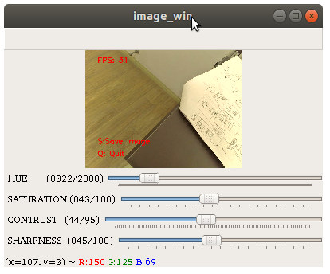
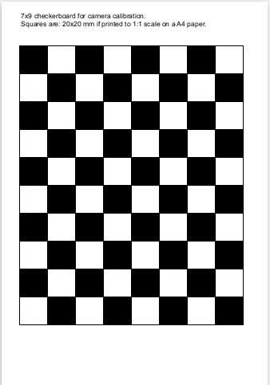
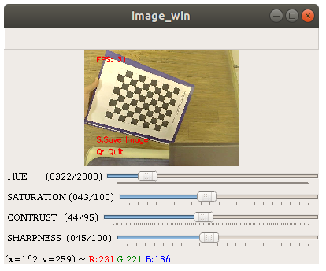
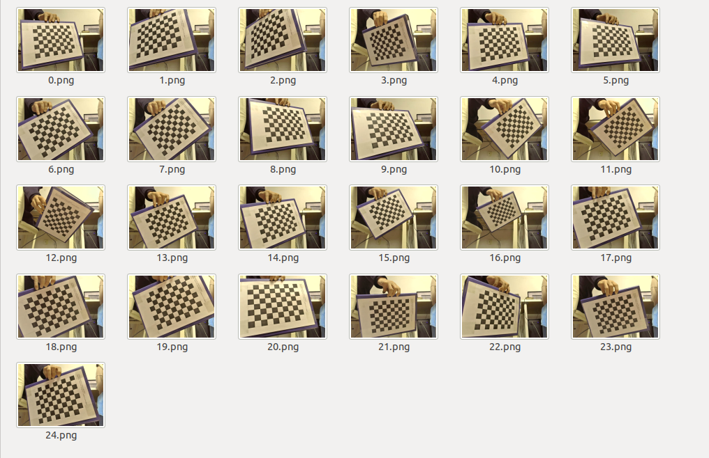
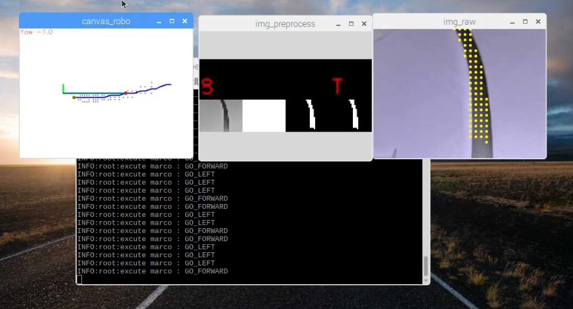

# DBSP双足机器人使用手册

[toc]

## DBSP

### DBSP工程文件

> 注: 如果你手里拿到的机器人是已经调试好的, 请跳过此步骤. 

DBSP工程文件存放在`src/data/dbsp`文件夹下, 后缀为`.svproj`格式的文件就是DBSP的工程文件.

使用DBSP的上位机上传动作组, 并完成机器人的零点标定. 详情见文档 `doc/附录B.其他教程/DBSP机器人动作编辑器使用指南`

### 添加/修改动作组

> 注: 如果没有修改动作组的需求, 可以跳过次部分.

使用DBSP的IDE添加/修改DBSP的动作组之后, 需要同步修改配置文件, 增加/修改对应的动作组类. 

在DBSP的整套系统里面, 动作组的名称叫`Marco` . 

我们在PC端调用DBSP的动作组的时候, 只关注两个属性

1. `Marco ID` 动作组的唯一标识

   DBSP上位机上并不能直接看到Marco ID, 需要你了解DBSP工程源文件的格式. 详情请参阅`doc/附录B.其他教程/DBSP的工程源文件解析`

2. `Marco Interval ` 动作组的周期, 单位是ms

   DBSP上位机上也不能直接看到Marco的执行的总时间, 有两种方式可以获取总时间

   一种是查看内部都包含哪些Action, 以及延时指令, 将其加在一起, 得到一个总时间.

   另外一个方式是, 创建一个新的Marco名字叫做`SUMMARY`，将当前的Marco添加到这个新的Marco里面, 在列表里面就可以看到总时间.


如果你想添加新的动作组的话, 可以在`src/dbsp_action_group.py` 里面添加一个新的类, 继承自`ActionGroup`, 并填写`marco`相关的参数.

```python
class ActionGroup(object):
    '''动作组'''
    name = 'NAME' # 运动的名称
    marco_id = 0 # 巨集的ID号
    marco_interval = 0 # 巨集的时间间隔

```

举例: 

```python
class StandUp(ActionGroup):
    # 站立
    name = 'STAND_UP'
    marco_id = 100000130
    marco_interval = 336
```

更规范一些, 可以将参数定义在`src/config.py`里面统一管理.

`src/config.py` 代码片段

```python
#############################
## DBSP动作组 Marco参数
##
#############################
# 站立的MarcoID
MARCO_STAND_UP_ID = 100000130
# 站立的执行周期(单位: ms)
MARCO_STAND_UP_INTERVAL = 336

```

修改后的`StandUp`类

```python
class StandUp(ActionGroup):
    # 站立
    name = 'STAND_UP'
    marco_id = MARCO_STAND_UP_ID
    marco_interval = MARCO_STAND_UP_INTERVAL
```


### 动作组管理器

> 注: 此部分只是用于讲解如何使用动作组, 无需配置,  可跳过

动作队列的管理以及调用需要通过`src/dbsp_action_group.py` 里面的`ActionGroupManager` 动作组管理器.

使用方法如下:

导入依赖

```python
import serial # PySerial串口通信
from dbsp_action_group import * # 导入动作组以及动作组管理器
from config import DBSP_PORT_NAME, DBSP_BAUDRATE # DBSP串口号以及波特率
```

创建串口对象

```python
# 串口初始化
uart = serial.Serial(port=DBSP_PORT_NAME, \
    baudrate=DBSP_BAUDRATE, parity=serial.PARITY_NONE, \
    stopbits=1, bytesize=8, timeout=0)
```

创建动作管理器

```python
am = ActionGroupManager(uart)
```

执行动作组(阻塞式)

```python
# 动作初始化(站立)
am.execute(StandUp())
```

重复执行多次

```python
am.execute(GoForward, n_repeat=5)
```

为了同时进行动作组管理以及图像处理等等其他的工作, 工程实现上使用了**多进程**的实现方式. 详情见`src/main.py` 里面的`worker_dbsp_action_group` 函数.


## 相机

### 相机脚本使用方法

脚本使用样例

```bash
python3 cv_camera.py　--device /dev/video0
```

默认树莓派上接的USB摄像头的设备号就是`/dev/video0` , 所以也可以不填写摄像头的设备号.

```
python3 cv_camera.py
```



选中窗口, 按下`Q`键, 退出图像预览程序.


查看`cv_camera.py`的帮助信息

```bash
python3 cv_camera.py --help
```

输出日志

```
$ python3 cv_camera.py --help
摄像头 Camera
功能列表
1. 相机拍摄画面预览
1. 图像采集并保存在特定的路径
2. UVC相机参数的可视化调参

备注:
1. 不同摄像头型号的可设置的参数及取值范围各不相同.
   当前的参数设置仅对机型KS2A418适用

flags:

cv_camera.py:
  --device: 摄像头的设备号
    (default: '/dev/video0')
  --img_cnt: 图像计数的起始数值
    (default: '0')
    (an integer)
  --img_path: 图像的保存地址
    (default: 'data/image_raw')
  --[no]rm_distortion: 载入相机标定数据, 去除图像畸变
    (default: 'false')

Try --helpfull to get a list of all flags.

```


### 调整UVC摄像头的参数

如果你发现画面存在较大的色差，或者画面过暗/过亮等问题, 这个时候可能需要对UVC摄像头的参数进行微调.

*备注*

1. 如果画面正常, 则请跳过次部分.
2. 色差这个问题, 有时候跟当前的光源也有关系, 如果是暖光灯下，偏黄是正常的.  调参时尽量排除光源的干扰.

执行如下脚本, 通过滑动条实时的修改UVC摄像头参数, 查看画面的变化.

```bash
python3 cv_camera.py
```


图像化界面里主要提供了四个关键的相机参数的可调节滑动条.

* HUE 色调
* SATURATION 饱和度
* CONTRUST 对比度
* SHARPNESS 锐度

拖动滑动条, 查看效果. 调完参数之后, 选中窗口, 按下`Q`键, 退出程序.

UVC摄像头参数掉电不保存, 重新上电恢复默认值. 所以每次启用摄像头的时候, 都需要从配置文件里面的摄像头参数, 然后通过命令行的方式, 设置UVC摄像头的具体参数.　机器人上选配的UVC摄像头的型号是`KS2A418`, 每款摄像头提供的可以配置的参数以及数值范围都是不同的.

相机的配置文件存放在`src/config.py` 的*相机参数* 部分．通过滑动条微调相机参数之后, 将所修改的数值, 同步更改到配置文件中．

`src/config.py`

```python
#############################
## 相机参数
##
#############################
# 摄像头的设备号
CAM_PORT_NAME = '/dev/video0'
# 画面宽度
CAM_IMG_WIDTH = 680
# 画面高度
CAM_IMG_HEIGHT = 480
# 亮度
CAM_BRIGHNESS = 4
# 对比度
CAM_CONTRUST = 44
# 色调
CAM_HUE = 322
# 饱和度
CAM_SATURATION = 43
# 锐度
CAM_SHARPNESS = 45
# GAMMA
CAM_GAMMA = 150
# 开启自动白平衡
CAM_AWB = True
# 白平衡的温度
CAM_WHITE_BALANCE_TEMPRATURE = 4600
# 自动曝光
CAM_EXPOSURE_AUTO = True
# 相对曝光
CAM_EXPOSURE_ABSOLUTE = 78
# 相机帧率
CAM_FPS = 30
```


### 相机标定

相机标定的目的有两个

1. 获得相机的内参矩阵

   图像的成像中心,  焦距

2. 获得相机的畸变系数



**第一步, 打印棋盘格标定 **

PDF文件存放在`src/data/相机标定板9x7.pdf` , 将其打印在A4纸上, 无边框打印. 打印出来之后, 每个黑色方块的宽度应该是20mm. 打印出来之后, 将其贴在一张硬纸板上.

**第二步, 清空历史图像**

清空`src/data/caliboard` 文件夹下所有的图像.

**第三步, 标定板图像采集**

 回退到`src`目录下, 执行脚本

```
python3 cv_camera.py --img_path data/caliboard
```

`--img_path` 用于指定捕获图像的存储路径, 这里设置存储路径为`data/caliboard`

选中当前的窗口`image_win`. 

手持标定板，放置在镜头前方, 变换不同的姿态, 同时也要保证棋盘的每个角点都在画面中出现. 

按下`S`键,　即为采集一张图像, 程序会自动给图像编号, 并保存在`src/data/caliboard`下.

参考图像采集张数为20张左右.



采集到的图像



**第四步, 进行图像标定**

运行脚本

```bash
python3 cv_camera_calibration.py 
```

运行日志

```
$ python3 cv_camera_calibration.py 
['data/caliboard/3.png', 
... 这里省略了一些png文件....
'data/caliboard/12.png']

相机内参 intrinsic
[[581.06526595   0.         357.93121291]
 [  0.         581.28993502 223.3983445 ]
 [  0.           0.           1.        ]]

畸变参数 distortion
[[-0.00094028 -0.11614309  0.00585255 -0.00532689  0.24779726]]

```

相机内参以及畸变系数会自动保存在`src/config/camera_info.bin ` 里面.


### 相机安装位置相关机械参数

> TODO 舵机云台做出来之后再进一步补充
>
> 实物图标注
>
> 云台标定等

```python
#############################
## 相机安装位置相关机械参数
## 
#############################
# 相机镜头中心相对地面安装的高度 (单位:cm)
CAM_H = 33
# 相机的俯仰角 (单位:度)
# 相机光心与水平面的夹角
CAM_PITCH = 60
```


### 更新透视逆变换映射矩阵

在得到相机的标定参数之后,　需要在线计算一次透视逆变换的映射矩阵.  

执行脚本

```bash
python3 update_ipm.py 
```

日志输出:

```bash
$python3 update_ipm.py 
计算IPM映射矩阵, 并存储在 config/ipm_remap.bin
更新完成
```


## 巡线例程

### 赛道规格

| 类目   | 明细     |
| ------ | -------- |
| 材质   | 广告纸   |
| 工艺   | 高清喷绘 |
| 背景色 | 白色     |
| 线色   | 黑色     |
| 线宽   | 4cm      |

> TODO 添加实物图


### 打开补光灯

在测试巡线例程之前, 需要连接两个补光灯到LAMP接口. 

手动打开LED补光灯的脚本

```bash
python3 lamp.py
```

此时正常情况下LAMP会被打开, `CTRL+C` 中断程序, 补光灯自动关闭.


### 测试曲线识别效果

打开LAMP

```
python3 lamp.py
```

新建另外一个Terminal, 执行图像处理(曲线拟合)的脚本, 图像处理的结果.

```
python3 cv_track_fit.py
```


`cv_track_fit.py`的帮助信息

```
$python3 cv_track_fit.py --help

--------------
| 赛道曲线拟合 |
--------------
颜色: 白底黑线
线宽: 4cm
材质: 广告布,高清喷绘

flags:

cv_track_fit.py:
  --device: 摄像头的设备号
    (default: '/dev/video0')
  --img_cnt: 图像计数的起始数值
    (default: '0')
    (an integer)
  --img_path: 图像的保存地址
    (default: 'data/image_raw')
  --[no]ipm_calc_online: 是否在线计算透视逆变换矩阵
    (default: 'false')
  --[no]rm_distortion: 载入相机标定数据, 去除图像畸变
    (default: 'false')

Try --helpfull to get a list of all flags.

```


### 脚本使用说明

在测试巡线例程之前, 需要连接两个补光灯到LAMP接口. 

进入`src`文件夹, 执行主程序`main.py`

```bash
python3 main.py
```

在机器人站立之后, 迅速将机器人放置与赛道起始位置.



程序一共有三个窗口

* `img_preprocess` 图像预处理窗口

  从左到右依次为:

  1. 原图的缩放图

  2. 赛道的二值化图像(包括广告布白色背景+线)

  3. OSTU阈值分割的画面, 白色区域为画面中黑线的连通域

  4. 黑线的二值化图像

     综合2跟3, 二值化运算得到的结果.

* `img_raw` 原始图像

  ​	画面中的黄色圆圈为黑线的采样点

* `canvas_robo` 机器人坐标系下的曲线

  * *灰点* 通过透视逆变换(IPM) 投影在机器人坐标系的采样点. 

  * *蓝线* 曲线的二次曲线拟合
  * *红点*  红点是复用的, 根据距离机器人由近到远依次为
    * 二次曲线上距离机器人最近的点
    * 机器人下一步所要到达的目标点
    * (可选) 曲线拐点, 从一个二次曲线过渡到另外一个二次曲线的拐点.


机器人开始巡线之后, 若想中断机器人巡线, 则需要选中程序中的任意一个窗口, 按下按键`Q`.  机器人会停止前进, 执行站立动作, 然后舵机卸力, 补光灯关闭. 


详细的调参指南见文档: `doc/巡线算法详解与调参指南`