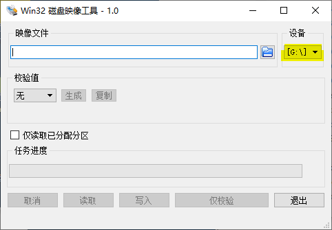
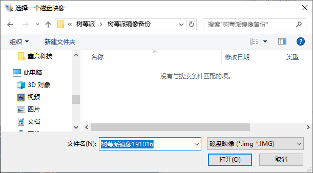
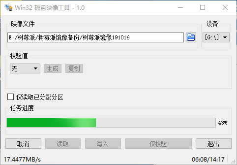
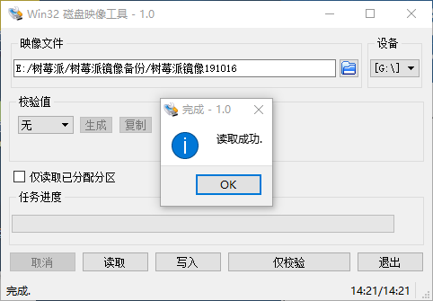
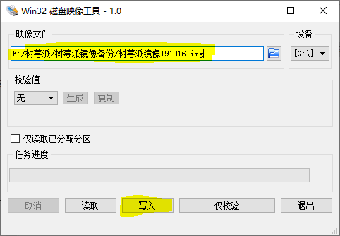
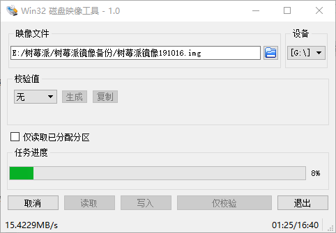
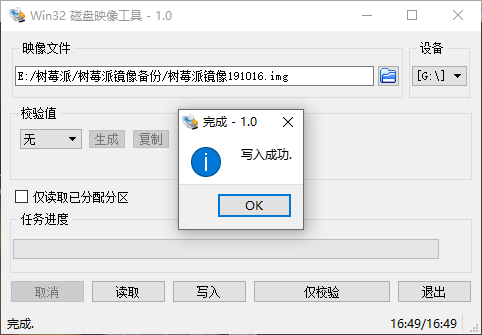

# 树莓派镜像导出与写入

假设在树莓派上已经配置好了开发环境, 如何再重新克隆一个树莓派系统呢?

这个时候我们需要先制作一个镜像文件, 然后再把这个镜像文件烧录到新的SD卡上面.

## 软件下载

> 注：树莓派镜像的备份写入操作，在Windows操作系统下完成.

镜像制作与备份需要用到Win32 Disk Imager这个软件

[Win32 Disk Imager 软件下载地址](https://sourceforge.net/projects/win32diskimager/)

下载安装包， 安装此软件

## 镜像导出

将要备份的树莓派SD卡插到读卡器里, 读卡器插入到电脑的USB口上.

运行此软件，选择设备号(刚才插入的这个读卡器)

填写镜像文件的保存路径, 给镜像取个名字

> 注: 记得后面再加一个.img后缀 上面的文字改成 `树莓派镜像191016.img`

点击打开。

接下来, 点击**读取**这个按钮, 将数据从SD卡中读入到这个img镜像文件里面。

>

读取成功

需要注意的是SD卡有多大，这个镜像文件就有多大.

选择的镜像存放路径要足够大.

>  友情提示: 如果是想存放在云盘，可以用7Z先压缩，然后再上传， 压缩之后只有4G

## 镜像写入

弹出之前的读卡器，放入空白的SD卡，重新插入电脑

找到之前保存的镜像文件, 并打开

> 如果你下载的镜像后缀是`.7z` 需要先解压缩得到img文件

点击**写入**

