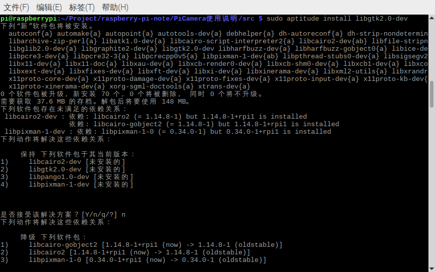
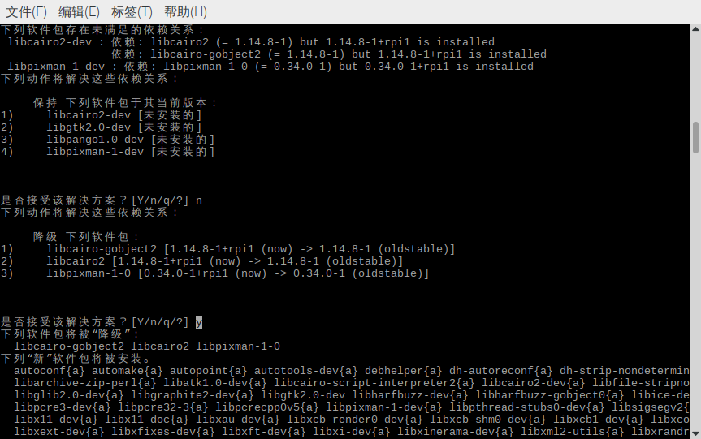

# OpenCV的编译与安装


[TOC]

## OpenCV版本选择

首先千万别用OpenCV4, 原因是OpenCV4在编译的时候会占用很多内存. 而树莓派3B+的内存只有1G, 在编译的过程中, 进度条到`98%`的时候就会卡死. 

所以在树莓派上, 还是选择OpenCV 3.X的系列.

选择的OpenCV版本型号为`3.4.7`


## 下载OpenCV源码

首先需要下载两个OpenCV的源码文件

不要使用`git clone` , 因为使用git clone下载的, 或者是直接用Github项目首页下载的`zip`文件, 默认都是`OpenCV4`版本, 直接从项目的`release`界面下载历史发行版. 另外`OpenCV`的版本与`OpenCV-Contrib`的版本必须严格一致.

[OpenCV-Release](https://github.com/opencv/opencv/releases)

[OpenCV 3.4.7 源码下载地址](https://github.com/opencv/opencv/archive/3.4.7.zip)

[OpenCV-Contrib-Release](https://github.com/opencv/opencv_contrib/releases)

[OpenCV-Contrib 3.4.7 源码下载地址](https://github.com/opencv/opencv_contrib/archive/3.4.7.zip)


建议是在自己的电脑上下载完成之后, 用U盘拷贝到树莓派上. 如果下载速度太慢, 可能需要使用代理.


## 降级安装GTK2

OpenCV的`HighGUI`模块需要用到GTK2.0, 但是在树莓派上面不能正常安装.

需要降级安装
```bash
sudo aptitude install libgtk2.0-dev
```

第一个选项选择`n` 拒绝给出的第一个方案.


第二个选项,降级安装方案,选择`y`



## 编译OpenCV

将zip文件拷贝到树莓派之后需要解压`.zip`源码文件.

按照教程进行操作:

[Ubuntu从源码编译OpenCV](http://www.1zlab.com/wiki/python-opencv-tutorial/ubuntu-compile-opencv-from-code/)

> 注: 教程是针对Ubuntu的, 对树莓派同样也适用。
