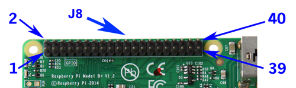
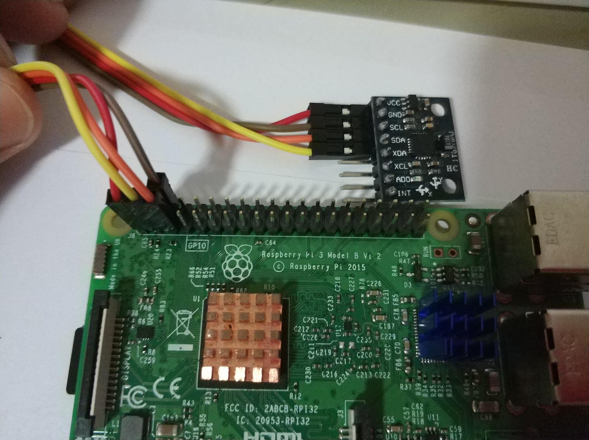
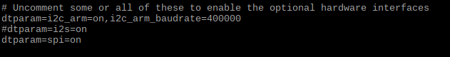

# MPU6050与树莓派通信


[TOC]

## 概要

本文涉及的内容

1. 树莓派I2C接口开启
2. MPU6050如何与树莓派进行连接
3. I2C相关的工具包的安装
4. 用Python尝试读取MPU6050的数据


## 模块型号

MPU6050是一个6DoF的IMU芯片, 内置了加速度计跟陀螺仪.在市面上有很多`GY-`开头的IMU模块型号, 很多都内置了MPU6050.

内置MPU6050的模块型号参考

1. `GY-521`
2. `GY-86`

> 注: 在购买MPU6050的时候, 注意别买到翻新的
>
> 几块钱的就不要买了.


## 物理接线

树莓派与MPU6050管脚连接映射:

| 树莓派GPIO编号 | MPU6050管脚 | 备注                                       |
| -------------- | ----------- | ------------------------------------------ |
| GPIO8          | SDA         |                                            |
| GPIO9          | SCL         |                                            |
| 3.3 VDC        | VCC         | GY521模块的供电电压范围是3.3-5V (内置稳压) |
| GND            | GND         |                                            |


树莓派管脚功能分布图

[Pin Numbering - Raspberry Pi 3 Model B](https://pi4j.com/1.2/pins/model-3b-rev1.html)





实物接线图:



## 开启树莓派的I2C开关

使用`raspi-config` 进行配置

```
sudo raspi-config
```

后续操作见文档[ Enable I2C Interface on the Raspberry Pi](https://www.raspberrypi-spy.co.uk/2014/11/enabling-the-i2c-interface-on-the-raspberry-pi/)


##  开启快速I2C模式

树莓派的Fast I2C模式, 可以使得I2C读取MPU6050原始数据的速度提升4倍

```
sudo leafpad /boot/config.txt 
```

找到下面这一行

```
dtparam=i2c_arm=on
```

然后在这一行的末尾添加`,i2c_arm_baudrate=400000`

```
dtparam=i2c_arm=on,i2c_arm_baudrate=400000
```




修改完成之后, 保存文件.

之后重启树莓派, 配置生效.

，


## 测试mpu6050

`src/rasp_mpu6050.py`里面是自写的一个MPU6050库文件.

该模块依赖`python3-smbus`, 运行前需要先安装`smbus`

```bash
sudo apt install python3-smbus
```

确保当前运行的Python脚本或者是Jupyter Notebook所在的文件夹有`rasp_mpu6050.py` 这个脚本文件。

> 注：接下来的测试推荐在Jupyter Notebook中测试

导入依赖

```python
from rasp_mpu6050 import RaspMPU6050
```

创建IMU对象

```python
# 初始化MPU6050对象
imu = RaspMPU6050()
```

获取加速度数据 

>  注: 加速度计的单位是: m/s^2  量程: [-4g, 4g], g为重力加速度.

```python
imu.get_accel_real()
```

获取陀螺仪数据

> 注: 陀螺仪的单位: deg/s , 简称dps ， 量程范围是[-500 dps, 500 dps]

```python
imu.get_gyro_real()
```

陀螺仪数据跟加速度计的数据，都存在尺度误差跟偏移量bias, 所以需要对他们进行标定.

其中加速度计的标定，需要使用六面标定法，详情见`src/IMU标定.ipynb`

标定完成之后，脚本会自动将标定数据保存在`src/config/imu_calibration.json` 文件里。

下次运行imu的时候，需要从配置文件中载入。

```python
imu.load_imu_calib_data(data_path='config/imu_calibration.json')
```


陀螺仪的标定比较简单, 保持陀螺仪绝对静止, 然后运行。

```python
imu.update_gyro_bias(n_repeat=5000)
```

`n_repeat` 是重复采样的次数. 陀螺仪标定数据采集之后, 需要保存

```python
imu.save_imu_calib_data(data_path='config/imu_calibration.json')
```

需要注意的是, 陀螺仪的bias并不是定值, 所以在实际使用过程中, 在短时间内陀螺仪是不需要重复标定的. 但是如果距离上次标定时间比较长, 或者温度变化比较大的情况下, 需要重新对陀螺仪进行标定.


`imu_calibration.json` 样例标定数据

```json
{
    "gz_bias": 0.014013660182440551,
    "gy_bias": 0.04380958582724328,
    "ay_scale": 0.0011836148852120611,
    "gx_bias": -0.030838713001234152,
    "gy_scale": 0.0002663161090079238,
    "az_bias": -0.47479669761828647,
    "az_scale": 0.001180781032611021,
    "gx_scale": 0.0002663161090079238,
    "ax_scale": 0.001189356280204607,
    "ay_bias": -0.2419925488728648,
    "ax_bias": -0.17095985575103076,
    "gz_scale": 0.0002663161090079238
}
```


## Reference

[Arduino教程：MPU6050的数据获取、分析与处理](https://zhuanlan.zhihu.com/p/20082486)

[InvenSense MPU-6050 官网](https://www.invensense.com/products/motion-tracking/6-axis/mpu-6050/)

[樹莓派 Raspberry Pi 使用 C++ 讀取 MPU-6050 加速度計與陀螺儀感測資料](https://blog.gtwang.org/iot/raspberry-pi-read-data-from-mpu6050-using-cpp/)

[使用 MPU-6050 的 DMP 來取得更精準的運動感測資料](https://blog.gtwang.org/iot/raspberry-pi-mpu-6050-read-data-using-dmp/)

