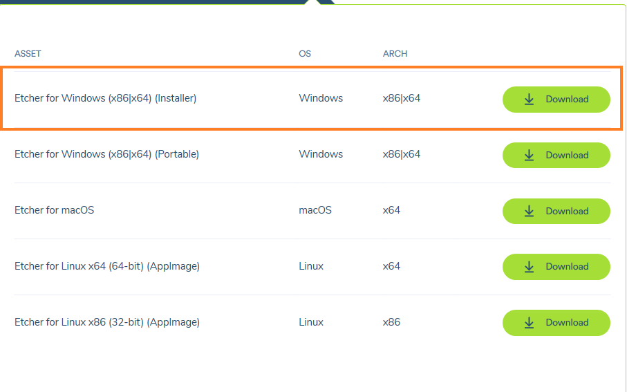
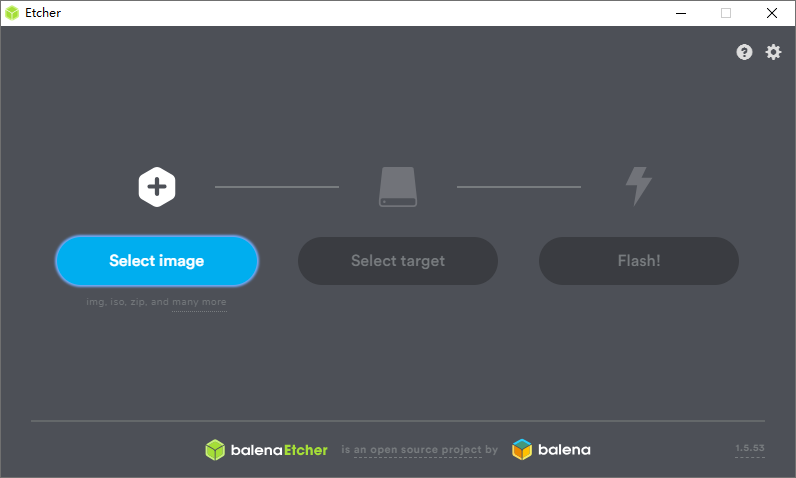
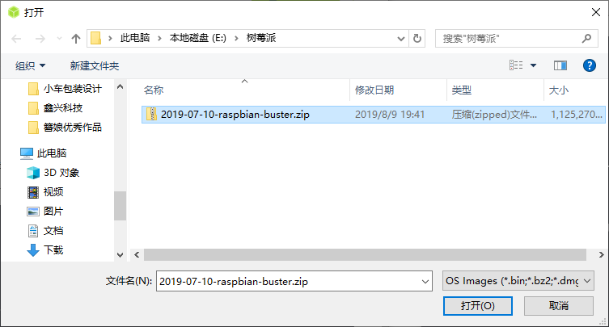
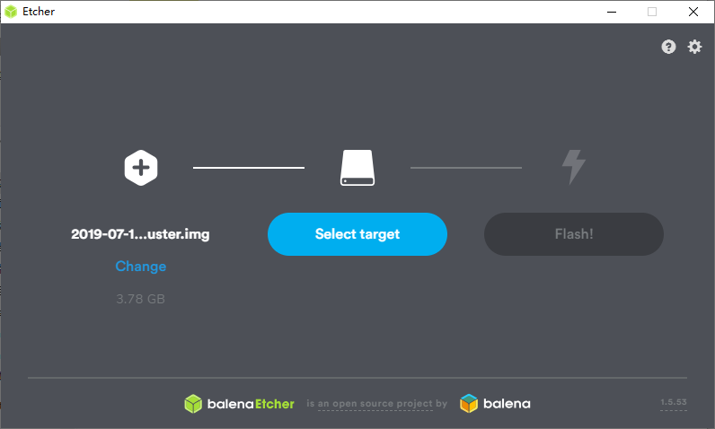
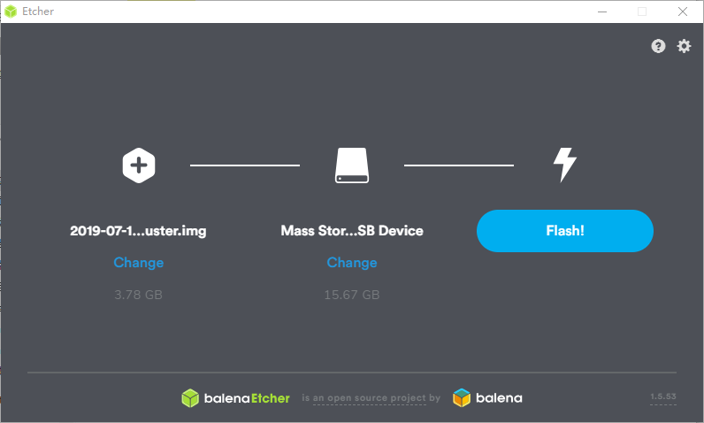
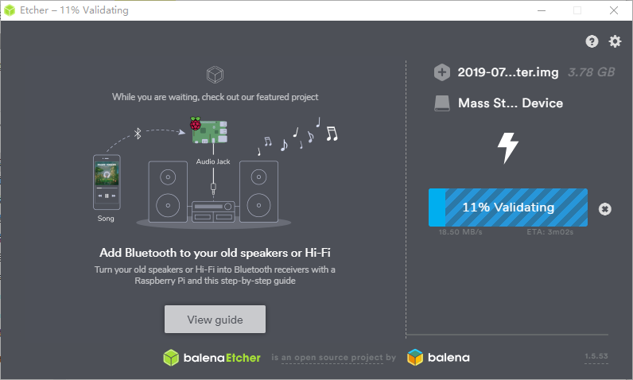

# 树莓派安装指南

[TOC]


## SD卡

准备一个16G(及以上)的SD卡, 还有读卡器.

[树莓派官方文档-SD卡要求](https://www.raspberrypi.org/documentation/installation/sd-cards.md)


## 镜像版本的选择

笔者在编写此文档的时候, 树莓派`Raspbian`的最新的发行版叫做`Buster`, 最新一次更新是`2019-07-12`. 此系统默认的Python3版本是`3.7` , 另外了使用了很新的gcc.  

因为次镜像很新, 所以对应的pip3里面没有部分包的预编译好的包, 需要自己编译. 而你在编译的时候就会发现因为gcc版本过新, C++标准不同, 导致有些包(例如OpenCV)无法完成编译.

所以请使用2019年-04-09发布的`Stretch`


[Raspbian镜像 历史镜像](https://downloads.raspberrypi.org/raspbian/images/)

[不同的树莓派Raspbian发行版下载地址](http://mirrordirector.raspbian.org/raspbian/dists/)


## 镜像下载

下载[raspbian-2019-04-09/](https://downloads.raspberrypi.org/raspbian/images/raspbian-2019-04-09/) 版本的树莓派img镜像。

下载`.zip`文件 [raspbian-2019-04-09/2019-04-08-raspbian-stretch.zip](https://downloads.raspberrypi.org/raspbian/images/raspbian-2019-04-09/2019-04-08-raspbian-stretch.zip)


## 安装树莓派系统镜像

> 注: 这部分截图是以buster为例演示的树莓派安装过程, stretch安装过程也相同.

详细操作过程见官方文档: 

[官方文档-系统安装指南](https://www.raspberrypi.org/documentation/installation/installing-images/)

[官方文档-Windows下镜像安装指南](https://www.raspberrypi.org/documentation/installation/installing-images/windows.md)

以Windows为例, 通过`balenaEtcher` 软件进行树莓派镜像烧录.

下载并安装[balenaEtcher](https://www.balena.io/etcher/)



下载安装完成之后, 运行此软件



选择刚才从树莓派官网下载的raspbian镜像文件(后缀`.zip`)

​	




选择要烧录的SD卡




将SD卡插入读卡器, 然后将读卡器插到电脑上， 软件自动识别.

> 注: 或者手动选择




点击Finish, 完成镜像烧写。



完成之后, 将SD卡拔出， 插入到树莓派上面. 

## 系统启动

安装完成之后, 将SD卡插入到树莓派上。

上电之后, 第一次进入系统, 会提示你做一些系统设置.

- 选择语言, 时区

  选择中文之后, 会自动安装输入法还有语言包

- 设置WIFI密码

- 更新系统软件


## 修改Raspbian源

国外的源下载起来太慢, 需要改成国内的源. 

这里以中科大的源为例讲解如何替换.

[中科大-Raspbian 源使用帮助](https://mirrors.ustc.edu.cn/help/raspbian.html)

使用`sudo`权限, 将`/etc/apt/source.list.d`里面的`raspi.list` 文件替换为如下内容:

```bash
deb http://mirrors.ustc.edu.cn/raspbian/raspbian/ stretch main contrib non-free rpi
#deb-src http://mirrors.ustc.edu.cn/raspbian/raspbian/ stretch main contrib non-free rpi
```


更新源, 检查软件更新

```bash
sudo apt update
```

更新软件

```bash
sudo apt upgrade
```


> 如果你想替换其他源的话, 需要注意:
>
> `raspbian 2018-04-19` 之后的镜像默认源已经更改，我们使用的是`raspbian-2019-04-09` 
>
> 注意地址路径url里面是`raspbian` , 另外发行版的名字也要匹配`stretch`


