# DBSP机器人动作编辑器使用指南


[TOC]

## 1. 概要

在刚开始上手DBSP的时候，因为对DBSP了解不多，软件不够熟悉，走了一些弯路。这篇文章记录了在使用BDSP的IDE过程中的笔记还有注意事项。


## 2. 连接DBSP开发板

> 操作必须严格按照顺序操作

1. 打开机器人电源
2. 用USB线连接机器人与PC
3. 打开FashionStar Develop DBSP 上位机
4. 刷新串口， 打开串口（同时设置波特率等参数）
5. 在`Servo Manager` 工具栏处，打开工程
6. 在`Servo Manager -> Servo` 工具栏，点击扫描舵机(更新舵机状态)


## 3. 工程文件操作

### 3.1 打开工程文件

假如现在再次重新打开IDE，当前显示的是空的工程，这个时候需要从Servo Manager里面打开`Open`按钮，打开`src/dbsp/track_man.svproj`  工程文件

> 注: 本文的配图是对旧的svproj文件的截图，与最新的动作设计有区别。


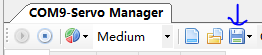

> TODO 改成左侧的那个icon
>
> 上位机打开dbsp的工程截图


## 4. 舵机

### 4.1 扫描舵机列表

在`COM?-Servo Manager `里面选取`Servo` 选择Scan，扫描所有的舵机

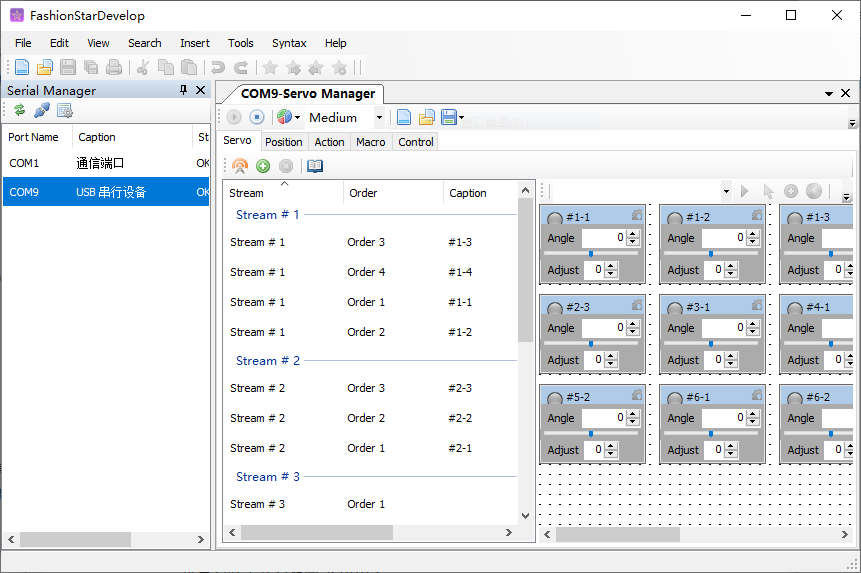


### 4.2 舵机在线调试

> TODO 配图　小闹钟

在`Servo` 工具栏下有 **保持Hold** 开关，默认是**关闭OFF**状态，此时舵机卸力。 

选择一个舵机，打开Hold模式， 然后点击闹钟样式的按钮， 开启RealtimeControl 模式(实时控制)。 

 此时拖动此舵机的角度滑动条， 舵机可以同步运动。


**注意: 在线运行一个Marco/Action之后，舵机列表的角度信息并不会自动更新，此时需要再次点击实时控制按钮(小闹钟)**

> 注: Action, Marco的概念在后续会提到。


### 4.3 舵机零点调整

当给一个机器人编辑好程序后，将程序用到另外一台机器人上面的时候，因为组装误差的原因，机器人并不能准确的执行原有的动作，此时需要进行零点调整。

视频教程: 

[DSBP舵机动作编辑偏差调整](https://fashionrobo.com/zh-hans/video-instruction-guides/)

调整思路:

1. 使用一个标准动作作为参考，此时的角度作为零点， **后续的所有的动作，都是基于这个参考动作来设计的**

   例如直立机器人直立时候， 关节的各个角度为0度。

   > 选用直立这个动作，是因为角度误差比较容易观测

2. 舵机卸力，然后手掰到想要的动作。

3. 舵机上力，使用软件进行**角度 Angle**微调(adjust), 直到达到一个完美的直立动作。

4. 设置舵机的**Adjust** 角度，让**角度 Angle**值为0.


### 4.4 舵机编号与机器人关节映射


舵机与DBSP主板的连接方式，串联顺序就决定了这个舵机的唯一标识。

**Stream 流** 代表DBSP舵机是接在DBSP开发板的第几个舵机接口上，编号从1-6

**Order 顺序** DBSP舵机是串联的，在一个Stream上的舵机，按照离开发板的距离，直接连在开发板上的舵机编号为1，后续依次递增。


在实际使用的时候，如果不知道机器人关节与对应舵机编号，可以通过在线调整功能来试验，调整某个舵机的角度，观察机器人上的哪个关节在动。


## 5. DBSP动作设计与测试

### 5.1 动作帧捕捉-添加Action

**Action 动作指令**，是**Command指令**中的一种类型， 它包含了各个舵机对应的目标角度，以及花多长时间运动到该目标角度。

可以在Action页面手动创建一个动作，也可以通过动作帧捕捉的技术创建一个Action，下面主要介绍如何通过动作帧捕捉添加动作帧。

首先将所有的舵机卸力，Hold开关设置为OFF状态。

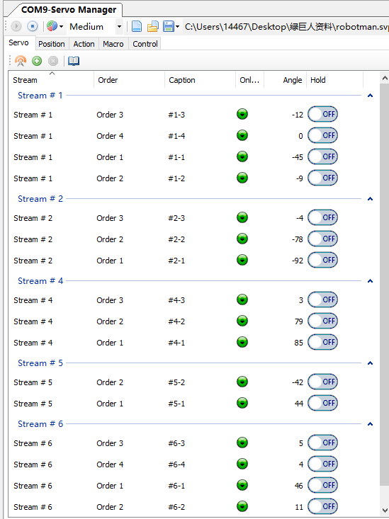

手动将机器人掰到想要的位置

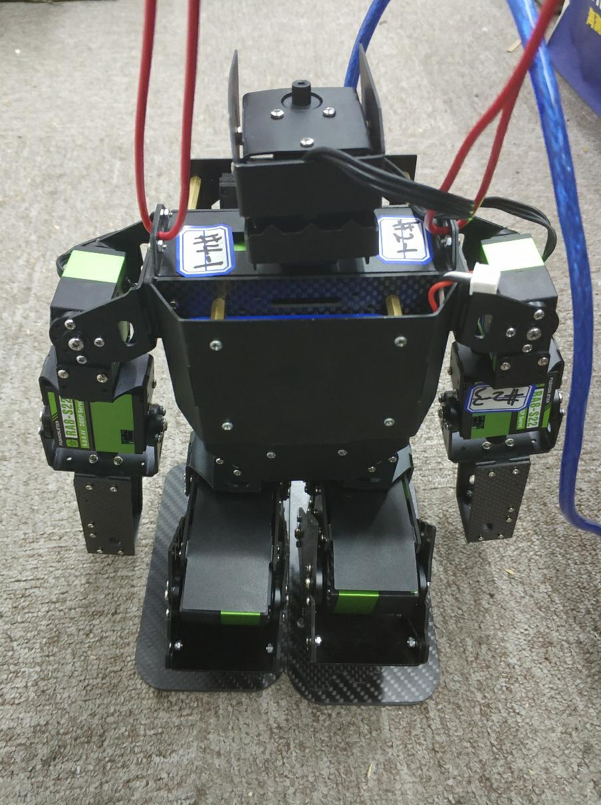


点击Servo工具栏下方的测量角度`Measure Angle`

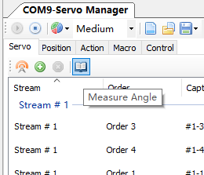


此时上位机会查询各个舵机的角度状态

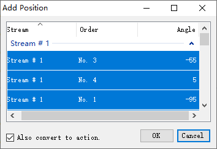

默认会自动将这个测量值转换为Action， 点击`OK`按钮

给这个新的动作命名为**蹲下**，同时也可以设置中间的间隔时间。如果勾选`As The Same Interval` 的话，各个舵机就会通过相同的时间旋转到目标角度。

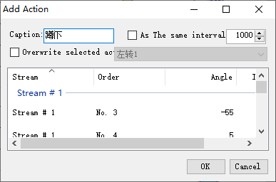


点击`OK`, 保存此Action.

打开`Action` 界面， 可以看到我们新添加的动作。 在Action界面，还可以选中某个特定的Action编辑角度`Angle`与间隔时间`Interval`. 

> 手动旋转往往不准确，此时可以通过软件对角度进行微调。

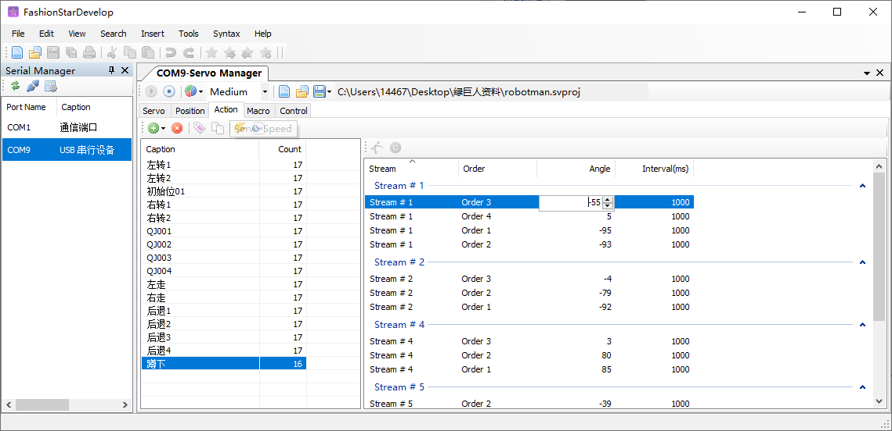


### 5.2 Marco 巨集

**Marco巨集** 由若干个**Command指令**构成，指令按照时间顺序依次执行。

**Command指令**有很多**Type 类型** 

- `Delay` 延时指令

  可以设置不同的延时时间，每个延时时间会创建一个Delay指令，延时多少ms，它的ID就是多少。

- `Action` 动作指令

- `Marco` 巨集 , Marco也可以由其他的Marco构成，但是只支持单层嵌套


#### 5.2.1 创建巨集

进入`Marco` 巨集界面，点击`+`号，添加一个新的Marco **蹲起**

创建完成之后，选中此Marco，在右侧的Marco详情页中添加相关的指令，完整系列动作。

关键属性介绍

* `Loop` 该指令执行多少次，单次执行就是1
* `Current Loop` 当前的循环的次数，随着程序的执行，动态更新。
* `Process Ratio` 执行百分比，所代表的含义是执行这个Command的前百分之多少的指令，默认是完全执行(100%)

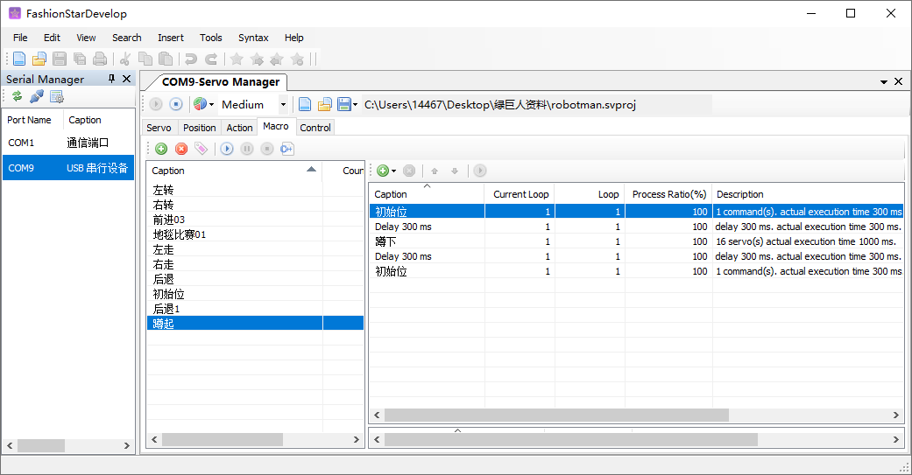


#### 5.2.2 执行Marco

选中特定的Marco，点击运行`Run Marco` 按钮，机器人就可以执行当前的Marco。DBSP每开始执行一条指令Command，就会给上位机发送一条反馈信号，上位机右侧展示的是当前执行到了哪个指令。

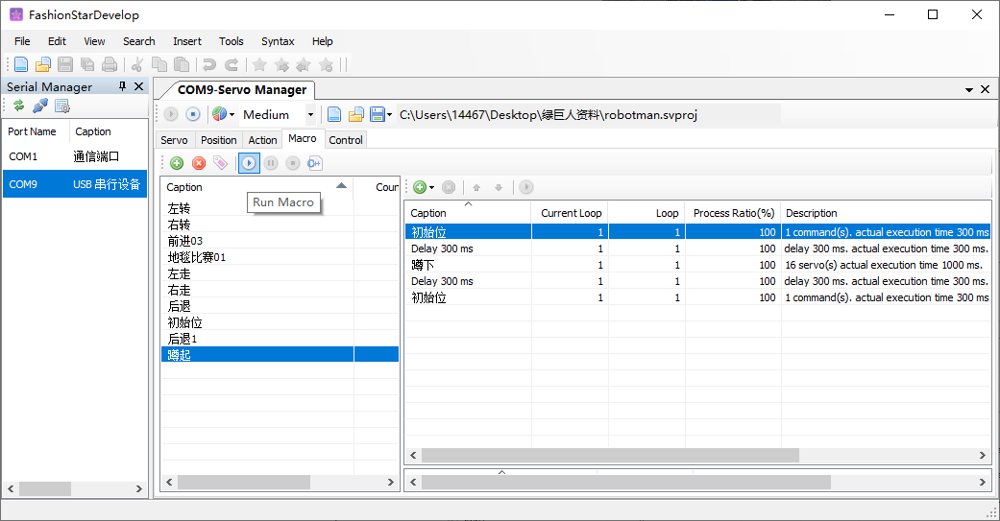


#### 5.2.3 查看Marco的信息

如果想通过MaixPy控制DBSP执行特定的Marco就需要知道每个Marco对应ID还有Marco执行所需要的总时间。

查看ID需要直接阅读工程文件的XML格式的源文件，用文本编辑器打开(例如VSCode)。

如下所示， 左转的这个Marco对应的ID就是`1208939356`

```xml
<Marcos>
    <Marco ID="1208939356" Caption="左转" Reserved="1">
      <Commands>
        <Command ID="494302969" Type="Action" Ratio="100" Loop="1" />
        <Command ID="50" Type="Delay" Ratio="100" Loop="1" />
        <Command ID="62411324" Type="Action" Ratio="100" Loop="1" />
        <Command ID="50" Type="Delay" Ratio="100" Loop="1" />
        <Command ID="746696029" Type="Action" Ratio="50" Loop="1" />
        <Command ID="300" Type="Delay" Ratio="100" Loop="1" />
      </Commands>
    </Marco>
   	...其他巨集...
</Marcos>
```


详情见`doc/DBSP的工程源文件解析/DBSP的工程源文件解析.md`


总时间，可以通过DBSP的IDE查看。创建一个空的Marco，然后再把你想要查询的Marco添加进来，在右侧的指令列表里面就可以看到这个Marco的总时长。

查的ID还有总时长之后，就需要更新`src/maixpy/robot_body.py` 对应动作的参数。

```python
class RobotBody:
    '''控制双足机器人身体的运动'''
    # 定义常量
    # 恢复初始状态
    MARCO_ID_INIT_POSE = 166367466
    MARCO_INTERVAL_INIT_POSE = 300
    # 向前走
    MARCO_ID_GO_FORWARD_STEP = 1656218031
    MARCO_INTERVAL_GO_FORWARD_STEP = 3000
    # 向后退
    MARCO_ID_GO_BACKWARD_STEP = 915727867
    MARCO_INTERVAL_GO_BACKWARD_STEP = 3500
    # 向左平移
    MARCO_ID_SHIFT_LEFT_STEP = 1962515968
    MARCO_INTERVAL_SHIFT_LEFT_STEP = 1100
    # 向右平移
    MARCO_ID_SHIFT_RIGHT_STEP = 37173147
    MARCO_INTERVAL_SHIFT_RIGHT_STEP = 1100
    # 向左转
    MARCO_ID_TURN_LEFT_STEP = 1913442680
    MARCO_INTERVAL_TURN_LEFT_STEP = 2000
    # 向右转
    MARCO_ID_TURN_RIGHT_STEP = 316806338
    MARCO_INTERVAL_TURN_RIGHT_STEP = 2000

    # 头部舵机的角度　(头部舵机单独控制)
    SERVO_ID_HEAD = 0x31
    # 舵机总数
    SERVO_NUM = 17
    ...略...
```


### 5.3 遥控手柄控制表 JoystickTable

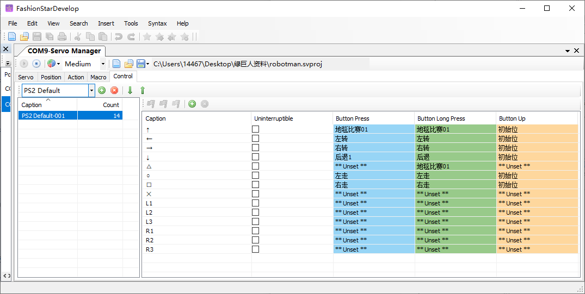

**JoystickTable 遥控手柄控制表** 定义了**Joystick 遥控手柄**不同的按键与状态与Marco巨集（用Marco的ID号来表示）之间的映射关系。

按键状态如下:

- 按键按下 `ButtonPress`
- 按键长按 `ButtonLongPress`
- 按键释放 `ButtonUp`


另外还可以设置当前的这个按键指令是否可以被中断，默认为**interruptible抢占式中断**。

也就是说，如果当前在执行某个动作，按下另外一个按钮， 马上中断原来的动作，然后执行新的动作。


**注意 只有在JoystickTable里面编辑了映射关系的Marco，在上传(upload)的时候，　Marco才会被保存在DBSP主控板里面**。在IDE中新建Marco的时候，这个Marco并没有保存在DBSP主板上，IDE是通过发送舵机角度控制指令来完成测试的。　

另外，如果一个按键没有编辑好与之对应的Marco，在MaixPy订阅了DBSP的按键事件之后, 该按键也不会产生回调函数。　


#### 5.3.1 从DBSP拓展版获取工程

> 什么时候需要这个功能?
>
> 1. 如果你手里的机器人是已经调整过偏移量的，你想直接获取你手里的这个机器人特定工程文件的时候，用此功能。
> 2. 手里没有这个机器人的工程文件的时候，通过这个功能，可以获取机器人的工程文件。


打开`Control` 工具, 然后导入数据。(向上箭头)

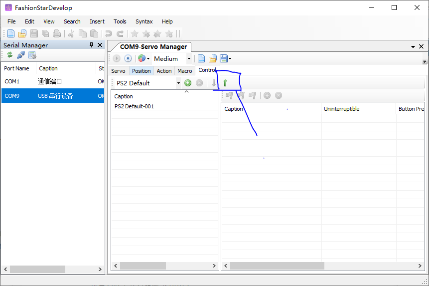

然后就可以得到/同步当前机器人内置的工程文件。

可以看到PS2上不同的按键状态对应的Marco(巨集)。


可以保存此工程文件


## 6. 调试经验与故障排查

### 6.1 舵机

**舵机掉线**

在IDE上，突然有舵机下线，或者调试机器人的时候，突然有几个舵机没了力气，机器人倾斜摔倒。需要检查：

- 首先检查舵机是否异常发热

- 断电，重启机器人，重新与电脑链接。

- 另外如果是因为电池没电，需要马上充电防止**电池过放**。 

  电池过放会导致航模电池的永久损坏。

**舵机限位**

DBSP不能设置舵机的最大角度和最小角度，在拖动滑动条的时候需要慢慢拖动，防止舵机卡住烧坏舵机。


### 6.2 动作调试

**调试顺序**

- 先调试腿部的动作，等腿部动作调试完成，机器人可以稳定的前进了，再调试手部的动作。　

或者等开发完成之后再添加上手部的动作。（左平移/右平移除外）

- 设计动作的时候，可以做两套动作，胳膊动与不动版本。因为比赛是避障赛，如果距离障碍物很近的时候，此时手臂还是保持不动比较好。

**调试时间**

- 不能长时间保持一个动作（例如单脚撑地）, 舵机受力，电流会升高，舵机会发烫。也有可能会烧毁舵机。
- 不能长时间调试，调试20分钟-30分钟，让机器人断电散热。

**零点设置**

- 机器人的舵机初始角度，可以调整offset。让左右两边的角度同为０，或者互为相反数。

  这样做的好处就是调好其中一个动作Action就可以映射为另外一个Action

  > TODO  零点的截图

**脚底板**

- 可以借助脚底板与地毯的摩擦力完成旋转动作
- 脚底板互锁之后，容易烧毁胯关节的舵机，需要防止脚底板打架(互锁)
- 可以用脚底板产生一个**预动作**，然后胯关节快速转动，完成左右平移的作用。


### 6.3 外部电源与电流

如果对机器人动作调试不熟悉的话，为了避免舵机损坏，建议使用带电流显示的外接电源。监控机器人的电流可以发现动作调试的问题。

- 机器人不Hold的时候 参考电流: 0.2A
- 机器人Hold的时候  参考电流: 0.7A

**电流突增**

如果遇到电流突然增加的情况(例如1-2A)，需要暂停调试，断电检查:

- 有无舵机发烫
- 舵机关节旋转是否流畅
- 舵机所受力矩是否过大，姿态是否需要调整

- 舵机的扭矩不够，机器人脚底舵机还有踝关节舵机受力最大，当倾角过大的时候，机器人的重量会加在舵机上，力矩就会增大，可能会超出舵机的力矩范围，此时电流会突然增大。

- 胯关节的舵机(5-1, 5-2)扭矩不够，步子迈大了之后，容易不完全回到初始位置的角度，此时电流会升高。

  抬一下机器人可以解决这个问题

**电池没电**

当航模电池欠压的时候，DBSP会发出**滴~滴~** 的声响，这个时候请换下航模电池进行充电。

**电源开关**

机器人用完需要记得关掉DBSP上面的开关，否则会导致电池过放，永久损坏。


### 6.4 配件

**USB接口**

需要注意在调试的时候需要防止机器人摔倒造成USB接口损坏，可以使用**3M的USB延长线**，在线调试机器人。


## 7. Reference

[Fashionrobo 官网](https://fashionrobo.com/)

[资料下载页](https://fashionrobo.com/zh-hans/download/)

[IDE使用-视频教程](https://fashionrobo.com/zh-hans/video-instruction-guides/)